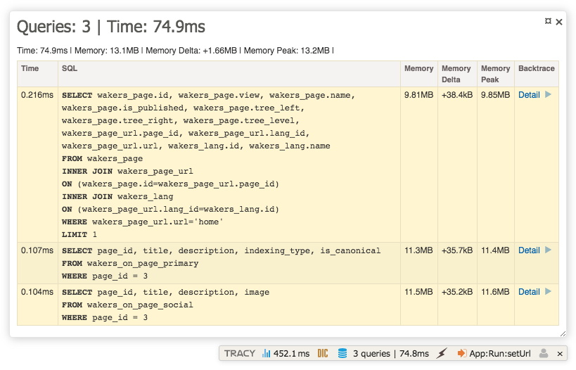

# Propel 2 ORM in Nette 2.4

Propel 2 ORM integration for Nette 2.4 **with Tracy debugger panel**.




## Installation

1. Install this **nette-extensions** via `composer require wakers/nette-propel2:v0.9`

2. Register this extensions in your application `config.neon`

    ```neon
    wakers-propel: Wakers\Propel\DI\PropelExtension
    ```

3. Add propel configuration file in `./app/config/db.local.neon` 

    ```neon
    wakers-propel:
        propel:
    
            general:
                project: Wakers CMS 5
                version: 5
    
            database:
                connections:
                    wakers_cms:
                        adapter: mysql
                        classname: Propel\Runtime\Connection\ProfilerConnectionWrapper
                        dsn: 'mysql:host=mariadb;dbname=wakers_cms_db'
                        user: root
                        password: root
                        attributes:
                        settings:
                            charset: utf8
    
            runtime:
                defaultConnection: wakers_cms
                connections:
                    - wakers_cms
    
            generator:
                defaultConnection: wakers_cms
                connections:
                    - wakers_cms
                tablePrefix: wakers_
                dateTime:
                    dateTimeClass: \Nette\Utils\DateTime
    
            paths:
                schemaDir: './app/schema'
                outputDir: './app/schema'
                phpDir: './app/schema/model'
                migrationDir: './app/schema/migration'
                sqlDir: './app/schema/sql'
    
            reverse:
                connection: wakers_cms
    
            migrations:
                tableName: 1_propel_migration
    ```

## Example

### Create schema
```xml
<database name="wakers_cms" namespace="Wakers\Module" defaultIdMethod="native"
          xmlns:xsi="http://www.w3.org/2001/XMLSchema-instance"
          xsi:noNamespaceSchemaLocation="http://xsd.propelorm.org/1.6/database.xsd"
>

    <table name="book" namespace="MyModule\DB" package="./book/">
        <column name="id" type="INTEGER" required="TRUE" primaryKey="TRUE" autoIncrement="TRUE"/>
        <column name="name" type="VARCHAR" required="TRUE" size="64"/>
    
        <unique>
            <unique-column name="name"/>
        </unique>
    </table>
    
</database>
```

### Use commands
Commands are same as official but with prefix **propel:** and without shortcuts.

```bash
# Compare DB with schema (eventually create migration)
./vendor/bin/wpropel propel:migration:diff

# Run migration
./vendor/bin/wpropel propel:migration:migrate

# Create model classes
./vendor/bin/wpropel propel:model:build

# Show all allowed commands
./vendor/bin/wpropel
```

### Create PHP code
```php
$con = Propel\Runtime\Propel::getConnection();

$con->beginTransaction();

try
{
    $book = new Wakers\Module\MyModule\Book;
    $book->setName('Any book name');
    $book->save();
    
    // Do something else
    
    $con->commit();
}
catch (Propel\Runtime\Exception\PropelException $exception)
{
    $con->rollBack();
}


$books = Wakers\Module\MyModule\BookQuery::create()->find();

foreach ($books as $book)
{
    bdump($book->getName());
}
```


## About Propel 2

Please think about using Propel 2 before you start, because actually Propel 2 is not maintained.

If you still want to use Propel2 in Nette, this extension is the right way.

**We're welcome pull request and issues.**